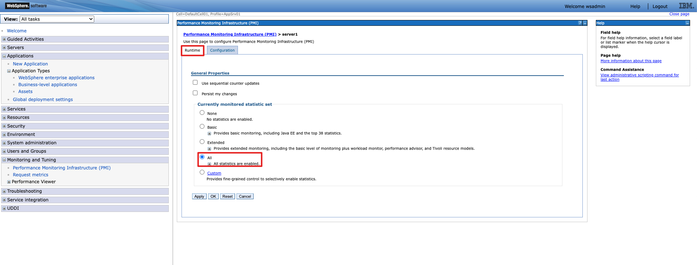

## 嘉为蓝鲸WAS监控bkpull插件使用说明

## 使用说明

### 插件功能
从web application server的监控指标接口拉取指标数据 

**是否支持远程采集:**

是

### 支持版本: 
- 9.0.5.7+
- 8.5.5.x
- 特殊版本8.5.5.16需要安装iFix补丁 
  

### 参数说明

| **参数名**     | **含义** | **是否必填** | **使用举例**                      |
|-------------|--------|----------|-------------------------------|
| metrics_url | 采集URL  | 是        | http://127.0.0.1:9443/metrics  |

### 使用指引
websphere application server监控需要完成以下操作

#### 获取metrics.ear文件
`metrics.ear` 文件存放于 `<WAS_HOME>/installableApps` 目录下。如果没有可以直接拿包上传安装。

#### 登录websphere
https://localhost:9043/ibm/console/login.do?action=secure

#### 安装metrics服务
1. 在工作台最左侧，选择Applications -> Application Type
- 选择右方视图中的 New Enterprise Application 

- 选择上传文件 metrics.ear，点击 Next 

- 选择Fast Path，点击 Next 

- 进入 Select installation options，保持默认选择，点击 Next 

- 进入 Map modules to servers，点击 Module 名称为 metrics的一栏中的Select，Select 下方出现 √ 选择才是正确的，点击 Next 

- 进入 Summary，点击 Finish 完成配置 

- 开始自动开始，等出现 Save 选择即可点击 

1. 安装完成后返回 Applications -> Enterprise Applications
- 查看右方视图，MetricsApp 一栏的 Application Status 是否正常，绿色箭头代表 Started，红色 × 代表Failed，出现绿色箭头才是正常部署状态 

- 如果是异常状态，可以尝试选择 MetricsApp 后再点击 Start 启动 

3. 配置监控指标
- 进入 Monitoring and Tunning - > Performance Monitoring Infrastructure (PMI) ，选择Name下发的server1 

- 选择 Runtime -> Currently monitored statistic set -> All ，点击OK，打开所有监控指标  

#### 获取metrics
获取metrics不需要账户和密码

8.x版本端口是9080
http://127.0.0.1:9080/metrics

9.x版本端口是9443
http://127.0.0.1:9443/metrics

FAQ: 
1. 访问采集不到监控指标  
先检查metics服务状态是否绿色箭头，排除服务异常问题后可尝试9080、9043、9443端口

### 指标简介

| **指标ID**                                      | **指标中文名**              | **维度ID**              | **维度含义**        |
|-----------------------------------------------|------------------------|-----------------------|-----------------|
| process_uptime_seconds                        | WAS进程已运行时间             | -                     | -               |
| was_connectionpool_create_total               | WAS连接池创建总数             | jndiname              | jndi名称          |
| was_connectionpool_close_total                | WAS连接池关闭总数             | jndiname              | jndi名称          |
| was_connectionpool_allocate_total             | WAS连接池分配总数             | jndiname              | jndi名称          |
| was_connectionpool_return_total               | WAS连接池返回总数             | jndiname              | jndi名称          |
| was_connectionpool_size                       | WAS连接池大小               | jndiname              | jndi名称          |
| was_connectionpool_free_connections           | WAS空闲连接总数              | jndiname              | jndi名称          |
| was_connectionpool_waiting_threads            | WAS等待线程总数              | jndiname              | jndi名称          |
| was_connectionpool_inUse_total                | WAS使用中连接总数             | jndiname              | jndi名称          |
| was_connectionpool_wait_total                 | WAS等待连接总数              | jndiname              | jndi名称          |
| was_connectionpool_connectionHandles          | WAS连接句柄总数              | jndiname              | jndi名称          |
| was_session_create_total                      | WAS会话创建总数              | appname               | 应用名称            |
| was_session_invalidated_total                 | WAS无效会话总数              | appname               | 应用名称            |
| was_session_life_time_seconds_total           | WAS会话持续总时间             | appname               | 应用名称            |
| was_session_finished_total                    | WAS完成会话总数              | appname               | 应用名称            |
| was_session_active_sessions                   | WAS活跃会话总数              | appname               | 应用名称            |
| was_session_live_sessions                     | WAS进行中会话总数             | appname               | 应用名称            |
| was_session_noRoomForNewSession_total         | WAS无法新建会话总数            | appname               | 应用名称            |
| was_session_externalRead_total                | WAS外部读取会话总数            | appname               | 应用名称            |
| was_session_externalWrite_total               | WAS外部写入会话总数            | appname               | 应用名称            |
| was_session_affinityBreak_total               | WAS会话亲和性断开总数           | appname               | 应用名称            |
| was_session_activated_total                   | WAS已激活会话总数             | appname               | 应用名称            |
| was_session_invalidatedByTimeout_total        | WAS超时无效会话总数            | appname               | 应用名称            |
| was_session_activateNonExistSession_total     | WAS激活但不存在的会话总数         | appname               | 应用名称            |
| was_threadpool_create_total                   | WAS线程池创建总数             | pool                  | 线程池名称           |
| was_threadpool_destroy_total                  | WAS线程池销毁总数             | pool                  | 线程池名称           |
| was_threadpool_active_threads                 | WAS活跃线程总数              | pool                  | 线程池名称           |
| was_threadpool_size                           | WAS线程池大小               | pool                  | 线程池名称           |
| was_threadpool_declaredThreadHungs_total      | WAS声明的线程挂起总数           | pool                  | 线程池名称           |
| was_threadpool_clearedThreadHungs_total       | WAS清除的线程挂起总数           | pool                  | 线程池名称           |
| was_threadpool_concurrentHung_threads         | WAS并发挂起线程总数            | pool                  | 线程池名称           |
| was_threadpool_active_time_seconds_total      | WAS活跃时间总秒数             | pool                  | 线程池名称           |
| was_transactionmanager_begun_total            | WAS事务管理器已启动事务总数        | transactiontype       | 事务类型            |
| was_transactionmanager_active_transactions    | WAS活跃事务总数              | transactiontype       | 事务类型            |
| was_transactionmanager_transactions_total     | WAS事务管理器事务总数           | transactiontype       | 事务类型            |
| was_transactionmanager_beforeCompletion_total | WAS预备完成总数              | transactiontype       | 事务类型            |
| was_transactionmanager_globalPrepare_total    | WAS全局准备总数              | transactiontype       | 事务类型            |
| was_transactionmanager_committed_total        | WAS提交事务总数              | transactiontype       | 事务类型            |
| was_transactionmanager_rolledback_total       | WAS回滚事务总数              | transactiontype       | 事务类型            |
| was_transactionmanager_timedout_total         | WAS超时事务总数              | transactiontype       | 事务类型            |
| was_servlet_uri_requests_total                | WAS Servlet URI 请求总数   | appname, servlet, uri | 应用名称, 应用路径, uri |
| was_servlet_uri_concurrent_requests           | WAS Servlet URI 并发请求总数 | appname, servlet, uri | 应用名称, 应用路径, uri |
| was_servlet_uri_response_time_seconds_total   | WAS Servlet URI 响应总时间  | appname, servlet, uri | 应用名称, 应用路径, uri |
| was_servlet_uri_responses_total               | WAS Servlet URI 响应总数   | appname, servlet, uri | 应用名称, 应用路径, uri |
| was_servlet_requests_total                    | WAS Servlet 请求总数       | appname, servlet      | 应用名称, 应用路径, uri |
| was_servlet_concurrent_requests               | WAS Servlet 并发请求总数     | appname, servlet      | 应用名称, 应用路径, uri |
| was_servlet_response_time_seconds_total       | WAS Servlet 响应时间总时间    | appname, servlet      | 应用名称, 应用路径, uri |
| was_servlet_responses_total                   | WAS Servlet 响应总数       | appname, servlet      | 应用名称, 应用路径, uri |
| was_servlet_errors_total                      | WAS Servlet 错误总数       | appname, servlet      | 应用名称, 应用路径, uri |
| was_servlet_loaded_total                      | WAS Servlet已加载的总数      | appname               | 应用名称            |
| was_servlet_reload_total                      | WAS Servlet 重载总数       | appname               | 应用名称            |
| was_extensionregistry_requests_total          | WAS扩展注册请求总数            | -                     | -               |
| was_extensionregistry_hit_total               | WAS扩展注册命中总数            | -                     | -               |
| was_extensionregistry_displacement_total      | WAS扩展注册置换总数            | -                     | -               |
| was_alarmmanager_create_total                 | WAS警报创建总数              | workmanager           | 工作管理器           |
| was_alarmmanager_fired_total                  | WAS警报触发总数              | workmanager           | 工作管理器           |
| was_alarmmanager_cancelled_total              | WAS警报取消总数              | workmanager           | 工作管理器           |
| was_alarmmanager_latency_seconds              | WAS警报延迟总时间             | workmanager           | 工作管理器           |
| was_alarmmanager_pending_alarms               | WAS挂起的警报总数             | workmanager           | 工作管理器           |
| was_scrape_duration_seconds                   | WAS指标抓取消耗时间            | -                     | -               |
| jvm_memory_committed_bytes                    | JVM 内存提交字节数            | area                  | 区域              |
| jvm_memory_max_bytes                          | JVM 内存最大字节数            | area                  | 区域              |
| jvm_memory_used_bytes                         | JVM 内存使用字节数            | area                  | 区域              |

